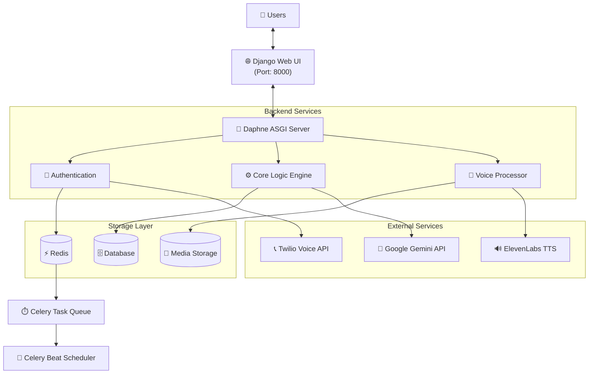

# MindMate - AI-Powered Mental Health & Wellness Platform

<div align="center">


*A comprehensive, real-time AI-powered mental health and wellness platform with voice capabilities, interactive games, and advanced psychological assessments.*

</div>

---

## 📋 Table of Contents

- [Overview](#overview)
- [Features](#features)
- [Technical Stack](#technical-stack)
- [System Architecture](#system-architecture)
- [Prerequisites](#prerequisites)
- [Setup & Installation](#setup--installation)
- [Running the Application](#running-the-application)
- [Project Structure](#project-structure)
- [License](#license)

---

## 🎯 Overview

**MindMate** is an innovative, enterprise-grade mental health and wellness platform that leverages artificial intelligence to provide accessible, personalized mental health support. Built with Django 5.1, it features real-time voice interactions, AI-driven psychological assessments, and an interactive gaming system designed to promote mental wellness.

---

## ✨ Features

### 🎤 Voice-Based Interactions
- Real-time voice calls with AI assistants
- Twilio-powered WebRTC connectivity
- ElevenLabs text-to-speech for natural conversations

### 🤖 AI-Powered Assessments
- Intelligent psychological assessment quizzes
- Google Gemini 3 Flash/Pro with automatic fallback
- Personalized mental health scoring
- Startup health checks for all API connections

### 🎮 Interactive Games & Activities
- Cognitive wellness games
- Mood-tracking gamification
- Stress-relief mini-games

### 👥 User Management
- Secure authentication with django-allauth
- User profiles with mental health history
- Privacy-focused data storage

### 📊 Analytics & Reporting
- Comprehensive mental health assessments
- Journal entry management
- Prescription tracking

### 🔄 Real-time Features
- WebSocket support via Django Channels
- Live chat with AI assistants
- Real-time progress updates

---

## 🛠️ Technical Stack

| Category | Technologies |
|----------|-------------|
| **Backend** | Django 5.1, Python 3.8+, Django Channels 4.0, Daphne 4.0 |
| **Task Queue** | Celery 5.3 with Redis |
| **AI/ML** | Google Gemini 3 (Flash/Pro), Cloudflare AI, `google-genai` SDK |
| **Voice** | Twilio Voice API, ElevenLabs Conversational AI |
| **Frontend** | Django Templates, Bootstrap 5, WebSocket API |
| **Infrastructure** | Redis, SQLite, ngrok (dev) |
| **Testing** | pytest, pytest-django, pytest-cov |

---

## 🏗️ System Architecture



---

## 📦 Prerequisites

### Required Software
- **Python 3.8+**
- **Redis** (for caching and Celery)
- **ngrok** (for voice call webhooks)

### API Keys Required
| Service | Purpose | Get From |
|---------|---------|----------|
| Google Gemini | AI Chat, Quiz, Prescription OCR | [ai.google.dev](https://ai.google.dev/) |
| Cloudflare AI | Sentiment Analysis | [dash.cloudflare.com](https://dash.cloudflare.com/) |
| Twilio | Voice Calls | [twilio.com/console](https://www.twilio.com/console) |
| ElevenLabs | Text-to-Speech | [elevenlabs.io](https://elevenlabs.io/) |

---

## 🚀 Setup & Installation

### 1. Clone the Repository

```bash
git clone https://github.com/yourusername/mindmate.git
cd mindmate
```

### 2. Create Virtual Environment

**Windows (PowerShell):**
```powershell
python -m venv venv
.\venv\Scripts\Activate.ps1
```

**macOS/Linux:**
```bash
python3 -m venv venv
source venv/bin/activate
```

### 3. Install Dependencies

```bash
pip install -r requirements.txt
```

### 4. Configure Environment

```bash
# Copy example config
cp .env.example .env

# Edit .env and add your API keys
```

### 5. Initialize Database

```bash
python manage.py migrate
python manage.py createsuperuser
```

---

## 🖥️ Running the Application

You need to run **5 services** in separate terminal windows:

### Terminal 1: Redis

```bash
# Using Docker
docker run -d --name redis -p 6379:6379 redis:latest

# Or if Redis is installed locally
redis-server
```

### Terminal 2: ngrok (for Voice Calls)

```bash
ngrok http 8000
# Copy the https:// URL and update NGROK_URL in .env
```

### Terminal 3: Daphne Server (Main Application)

```powershell
# Windows
.\venv\Scripts\Activate.ps1
daphne -b 0.0.0.0 -p 8000 perplex.asgi:application
```

```bash
# macOS/Linux
source venv/bin/activate
daphne -b 0.0.0.0 -p 8000 perplex.asgi:application
```

### Terminal 4: Celery Worker

```powershell
# Windows
.\venv\Scripts\Activate.ps1
celery -A perplex worker -l info -P solo
```

```bash
# macOS/Linux
source venv/bin/activate
celery -A perplex worker -l info
```

### Terminal 5: Celery Beat (Scheduler)

```powershell
# Windows
.\venv\Scripts\Activate.ps1
celery -A perplex beat -l info
```

```bash
# macOS/Linux
source venv/bin/activate
celery -A perplex beat -l info
```

### Access Points

| Service | URL |
|---------|-----|
| **Web App** | http://localhost:8000 |
| **Admin Panel** | http://localhost:8000/admin |
| **Voice Calls** | http://localhost:8000/voice/ |
| **Games** | http://localhost:8000/games/ |

---

## 📁 Project Structure

```
mindmate/
├── accounts/              # User authentication & profiles
│   ├── models.py          # User profile models
│   ├── views.py           # Auth views
│   └── forms.py           # Registration forms
│
├── app/                   # Core application
│   ├── models.py          # Main data models
│   ├── views.py           # Core views & AI chat
│   └── urls.py            # URL routing
│
├── games/                 # Gamification & wellness games
│   ├── models.py          # Game models
│   └── views.py           # Quiz & game logic
│
├── voice_calls/           # Voice integration module
│   ├── consumers.py       # WebSocket consumers
│   ├── tasks.py           # Celery tasks
│   └── routing.py         # WebSocket routing
│
├── perplex/               # Django project settings
│   ├── settings.py        # Main settings
│   ├── apps.py            # Startup health checks
│   ├── asgi.py            # ASGI configuration
│   ├── celery.py          # Celery configuration
│   ├── urls.py            # Root URL routing
│   └── services/          # Centralized AI services
│       ├── gemini_service.py
│       ├── cloudflare_service.py
│       ├── elevenlabs_service.py
│       ├── twilio_service.py
│       └── health_check.py
│
├── tests/                 # Test infrastructure
│   ├── unit/              # Unit tests
│   └── integration/       # Integration tests
│
├── templates/             # Global templates
├── media/                 # User uploads
├── requirements.txt       # Python dependencies
├── .env.example           # Example environment config
└── README.md              # This file
```

---

## 📝 License

© 2026 MindMate-AI. All rights reserved.

This is a demo/portfolio project for educational purposes.
